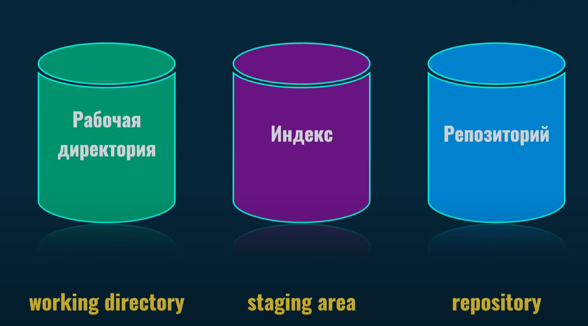
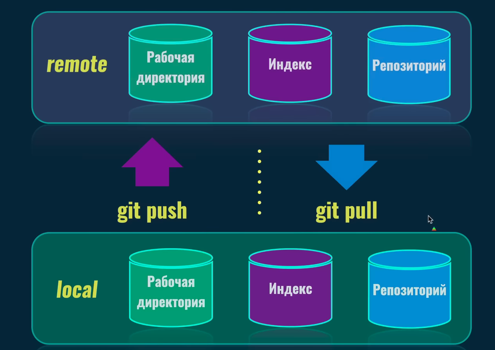

# КОМАНДЫ GIT

## ОСНОВНЫЕ КОМАНДЫ

[Шпаргалка](https://frontend-stuff.com/blog/git-cheat-sheet/)

### Сервисы хостинга GIT репозиториев
*Самые распространенные сервисы*
1. [GitHub](https://github.com/)
2. [BitBucket](https://bitbucket.org/)
3. [GitLab](https://about.gitlab.com/)

---

## 1.1 Основные команды терминала
* Проверка версии GIT  
```
git --version   
``` 
* Команда выводит путь к текущей папке  
```
pwd   
```  
* Создание папки
```
mkdir название папки
```
* Перейти в папку 
```
cd название папки
```
* Перейти в родительскую папку
```
cd ..
```

* Создание пустого файла
```
touch название файла
```

*  Создание файла с текстом
```
echo "Any text" > file.txt
```
* Список файлов в папке
```
ls
```
* Прочитать файл
```
cat file.txt
```
* Удаление файла
```
rm file.txt
```
---

## 2.1 Git – Основы – Конфигурация
[Подробнее здесь](https://www.youtube.com/watch?v=hWiqh6YUUS8&list=PLDyvV36pndZFHXjXuwA_NywNrVQO0aQqb&index=2)

### Настройка имени и email автора
* **gitconfig** - Изменение конфигурации Git
* **--global** - Имя будет настроено глобально для всех репозиториев
* **user.name** - Настройка имени автора
* **user.email** - Настройка емэйла автора

*Имя автора будет использоваться во всех репозиториях на вашем компьютере и будет браться из этого файла конфигурации*
```
git config --global user.name "Your Name"
```
```
git config --global user.email "your email"
```

### Просмотр всех настроек Git
```
git config --list
```
```
git config --list --global
```
```
cat ~/.gitconfig
```
```
git config user.name
```
```
git config user.email
```
Более подробную информацию о config можно получить с помощью команды
```
git help config
```
-

## 2.2 Git – Основы – Создание репозитория, первый коммит
[Подробнее здесь](https://www.youtube.com/watch?v=j2F77U-2FuQ&list=PLDyvV36pndZFHXjXuwA_NywNrVQO0aQqb&index=3)


### Создание нового репозитория на компьютере в текущей папке
*Команда вводится в той папке, в которой планируется создать новый пустой репозиторий*
```
git init
```
После инициализации репозитория создается скрытая папка **.git**

-

### Удаление локального репозитория

Если был создан случайно репозиторий локально, можно просто удалить папку .git, это полностью уничтожит репозиторий  и, разумеется, отменит то,что сделал ``` git init``` команда:  
```
rm -r .git
```
-

### Связывание локального репозитория с удаленным
```
git remote add origin URL репозитория
```
* Отображение скрытых папок и файлов  
Terminal, iTerm2 (Mac), Git Bash (Windows)  
```
ls -la
```
* PowerShell (Windows)  
```
ls -Force
```
-

### Области Git



* Рабочая директория (**Working directory**) - видимые файлы и папки проекта.
* Индекс (**Staging area**) - в эту область добавляются файлы, которые хотим сохранить. Подготавливаем файлы для коммита.
* Репозиторий (**Repository**) - сохранение файлов в репозиторий. То,что находится в папке .git. Там хранится информация обо всех версиях проекта, коммитов 

Зона **Staging area** и **Repository** скрыты в папке .git

### Проверка текущего состояния репозитория
Эта команда показывает те изменения,которые уже находятся в **Staging area** и которые были подготовлены для коммита.

```
git status
```
*ВСЕ ОБЪЕКТЫ GIT СОХРАНЯЮТСЯ В ПАПКУ objects, в которой создаются подпапки с хэш-номером(уникальный идентификатор) объекта.*

### Добавление файлов в Staging area
Команда *git add* добавляет файл, либо файлы из **Working directory**  в **Staging area**

```
git add название файла
```
Этой командой мы подготавливаем файлы для сохранения в репозиторий, посредством перемещения в **Staging area**

-

### Сохранение изменений (commit)

**Git – Основы – Хороший коммит**
[Подробнее здесь](https://www.youtube.com/watch?v=WlIzoLK46is&list=PLDyvV36pndZFHXjXuwA_NywNrVQO0aQqb&index=7)

Команда *git commit* сохраняет файлы из **Staging area** в **Repository**

#### КОММИТ (Commit)

Коммит - это ссылка на определенное дерево. Все коммиты связаны между собой. Также это объект git, который созраняется в папке .git.

Указатель(Ссылка) **HEAD** на определенный коммит, т.е. в **Working directory** мы видим именно ту версию проекта, на которую ссылается **HEAD** указатель

Ветка ссылки всегда ссылается на последний коммит, чтобы видеть самую свежую версию.
```
git commit
```
Сохранение всех изменений из **Staging area** в **Repository** с названием коммита  
*Сообщение указывает на то,что сделано в этом коммите*
```
git commit -m "message"
```
-

## 2.3 Git – Основы – Git и права на файлы
[Подробнее здесь](https://www.youtube.com/watch?v=KrlYu1ToS-o&list=PLDyvV36pndZFHXjXuwA_NywNrVQO0aQqb&index=4)

### Статусы отслеживания файлов
* **Untracked** - Неотслеживаемый, те файлы, которые только что добавили в **Working directory** (Новый файл)

*  **Staged** - Подготовленный, файл, добавленный в **Staging area**

* **Unmodified** - Немодифицированный, те файлы, которые сохранены в **Repository**

* **Modified** - Модифицированный, файлы находящиеся в рабочей директории и которые можно подготовить для сохранения(перенести в **Staging area**) после этого их состояние становится **Staged**

---

## 2.4 Git – Основы – Git show, кто такие автор и коммиттер
[Подробнее здесь](https://www.youtube.com/watch?v=_qWWtXu07GI&list=PLDyvV36pndZFHXjXuwA_NywNrVQO0aQqb&index=5)

**git show** показывает текущий коммит

```
git show
```
```
git show --pretty=fuller
```
Можно указать автора коммита командой (эта команда меняет автора а не коммитепа)
```
git commit --author='John Smith <john@me.com>' --date'...'
```
-

## 2.5 Git – Основы – Добавление файлов и директорий, git status
[Подробнее здесь](https://www.youtube.com/watch?v=xzEMA7rzN3Y&list=PLDyvV36pndZFHXjXuwA_NywNrVQO0aQqb&index=6)

**git-status** показывает какие файлы были изменены или добавлены, а также показывает какие файлы находятся в **Staging area**
```
git status
```
Команда **git add** подготавливает файлы перед коммитом, занося их в **Staging area**
[Подробнее здесь](https://ru.stackoverflow.com/questions/431839/%D0%92-%D1%87%D0%B5%D0%BC-%D1%80%D0%B0%D0%B7%D0%BD%D0%B8%D1%86%D0%B0-%D0%BC%D0%B5%D0%B6%D0%B4%D1%83-git-add-add-a-add-u-%D0%B8-add)
```
git add
```
Команда **git add .** добавит файлы только текущей директории, в которой запущена команда и добавит их в в **Staging area**
```
git add .
```
Команда **git add -A** возьмет абсолютно все файлы, которые находятся в папке,в которой был создан репозиторий и добавит их в в **Staging area**
```
git add -A
```
**Git – Основы – Зачем нужен индекс?**
[Подробнее здесь](https://www.youtube.com/watch?v=75TOiisShWw&list=PLDyvV36pndZFHXjXuwA_NywNrVQO0aQqb&index=8)

С флагом git add -p Git даст возможность для каждого измененного фрагмента в файле предложит нам решить добавлять его в Index или нет
```
git add -p "file name"
```

Вы можете создать .gitignore файл в корневом каталоге репозитория, чтобы сообщить Git, какие файлы и каталоги игнорировать при фиксации.
[Подробнее здесь](https://docs.github.com/ru/get-started/getting-started-with-git/ignoring-files)
```
.gitignore
```
Даже если файл находиться в .gitignore его можно добавить с помощью команды
```
git add --force "file name"
```
 Если рабочая папка не содержит файлов, но вы ее хотите добавить в репозиторий.
 Чтобы это обойти, в дерикторию поместите вспомогательный файл.
```
.gitkeep
```
-

## 2.8 Git – Основы – Коммиты без git add
[Подробнее здесь](https://www.youtube.com/watch?v=UX7O3oekwFA&list=PLDyvV36pndZFHXjXuwA_NywNrVQO0aQqb&index=9)

Сразу записать изменения в репозиторий. Ограничение(игнорирует файлы которые не  отслеживаются Git)
```
git commit --all -m 'commit text'
```
*Alias* 
```
git config --global alias.commitall '!git add -A;git commit'
```
*Alias (пример использования)* 
```
git commitall -m 'commit text'
```

Краткая запись
```
git commit -am 'commit text'
```

Если надо один файл добавить 
```
git commit -m 'commit text' "file name"
```
-

## 2.9 Git – Основы – Удаление и переименование файлов
[Подробнее здесь](https://www.youtube.com/watch?v=W71P4I0MGr0&list=PLDyvV36pndZFHXjXuwA_NywNrVQO0aQqb&index=10)

Глобальная настройка файла .gitignore
```
git config --global core.excludesFile "$Env:USERPROFILE\.gitignore"
```
Для удаления файлов в Git существует команда (удаляет файлы из рабочей директории и из Index)
```
git rm "path"
```

Если указывать директорию добавляем флаг **-r**
```
git rm -r "example src"
```
Удаляет из Index но оставляет в рабочем каталоге. Применяется  часто к файлам которые хотим оставить в рабочем каталоге, но в дальнейшем не хранить в Git
```
git rm -r --cached "example src"
```
Переименовать файлы можно с помощью команды
```
git mv <old> <new>
```
-

## 3.1 Git – Ветки – Введение
[Подробнее здесь](https://www.youtube.com/watch?v=aSohh-m5vJY&list=PLDyvV36pndZFHXjXuwA_NywNrVQO0aQqb&index=11&ab_channel=JavaScript.ru)

**ВЕТКА** - это ссылка на коммит. Когда мы работаем в рамках одной ветки, Git автоматически перемещает ссылку на самый последний коммит. Указатель **HEAD** используется для переключения между ветками и перехода на разные коммиты этих веток.

Команда создания новой ветки. Название лучше давать такое, по которому можно понять,что именно разрабатывается в этой ветке.

-

## 3.2 Git – Ветки – Создание и переключение
[Подробнее здесь](https://www.youtube.com/watch?v=ydtgQSaUzw0&list=PLDyvV36pndZFHXjXuwA_NywNrVQO0aQqb&index=12&ab_channel=JavaScript.ru)

Отображает список ветвей в проекте

```
git branch
```
Отобразит ветку и информацию о последнем коммите
```
git branch -v
```
Создаем новую ветку командой
```
git branch <branch name>
```
Команда **git checkout** с помощью нее и хэш номера коммита можно перейти в определенную версию проекта
Можно использовать 4 или 5 начальных символов коммита. После этого Git переместит указатель HEAD на определенный коммит, который мы указали. Т.е git возьмет объекты,соответствующие этому коммиту и переместит их в рабочую область.

Также с помощью этой команды можно перейти на определенную ветку проекта. Ветка ссылается на последний коммит,сделанный в этой ветке

Переключение между ветками. Указатель HEAD перемещается на указанную ветку 
```
git checkout <branch name>
```
Создание новой ветки и переход в нее (создает и сразу переключает на созданную ветку)
```
git checkout -b <branch name>
```
Переименовать **ТЕКУЩУЮ** ветку
```
git branch -m <new branch name>
```
Удаление ветки. Текущую ветку нельзя удалить, если вы хотите удалить текущую ветку, нужно из нее выйти
```
git branch -d <branch name>
```

Абсолютно любая ветка доступна нам после того, как мы установили связь с удаленным репозиторием и мы можем на нее переключаться с помощью команды  ``git checkout branch name``

-

## 3.3 Git – Ветки – Команда checkout при незакоммиченных изменениях
[Подробнее здесь](https://www.youtube.com/watch?v=KxKjBneF_NI&list=PLDyvV36pndZFHXjXuwA_NywNrVQO0aQqb&index=13&ab_channel=JavaScript.ru)

**Force a Checkout**

Вы можете передать опцию **-f** или **--force** с командой **git checkout**, чтобы заставить Git переключать ветки , даже если у вас есть непроиндексированные изменения (другими словами, индекс рабочего дерева отличается от HEAD). По сути, его можно использовать для отмены локальных изменений.
```
git checkout --force <branch name>
```
Команда **git stash** позволяет на время архивировать (или «отложить») изменения, сделанные в рабочей копии, чтобы вы могли применить их позже.
```
git stash
```
Затем вернуть изменения командой
```
git stash pop
```
-

## 3.4 Git – Ветки – Перенос незакоммиченных изменений
[Подробнее здесь](https://www.youtube.com/watch?v=mlxmxsBzIMs&list=PLDyvV36pndZFHXjXuwA_NywNrVQO0aQqb&index=14&ab_channel=JavaScript.ru)

-

## 3.5 Git – Ветки – Перенос веток "вручную"
[Подробнее здесь](https://www.youtube.com/watch?v=6oZG-pAeHRE&list=PLDyvV36pndZFHXjXuwA_NywNrVQO0aQqb&index=15&ab_channel=JavaScript.ru)

-

## 3.6 Git – Ветки – Состояние отделённой HEAD
[Подробнее здесь](https://www.youtube.com/watch?v=g0GgtqlhHaw&list=PLDyvV36pndZFHXjXuwA_NywNrVQO0aQqb&index=16&ab_channel=JavaScript.ru)

-

## 3.7 Git – Ветки – Восстановление предыдущих версий файлов
[Подробнее здесь](https://www.youtube.com/watch?v=3z-LjQacu2Q&list=PLDyvV36pndZFHXjXuwA_NywNrVQO0aQqb&index=17&ab_channel=JavaScript.ru)

-

## 3.8 Git – Ветки – Просмотр истории и старых файлов, символы ~, ^, @, поиск с :/ 
[Подробнее здесь](https://www.youtube.com/watch?v=l-sTQBr3rXY&list=PLDyvV36pndZFHXjXuwA_NywNrVQO0aQqb&index=18&ab_channel=JavaScript.ru)

Команда **git log** показывает историю изменений коммитов
```
git log
```
Компактный вывод коммитов
```
git log --oneline
```
Вывод коммитов из ветки main
```
git log main --oneline
```
По умолчанию показывает **коммит из HEAD** 
```
git show
```
Hо можно передать любой другой (например через ссылку или ID)
```
git show main
```
**git show HEAD**. Эта команда отобразит идентификатор фиксации, на который в данный момент указывает HEAD
```
git show HEAD. HEAD мождно заменить символом '@'
```
С тильда коммит на родителя ниже
```
git show HEAD~
```
С двумя тильда коммит на родителя ниже (флаг *--quiet* для краткости информации без изменений)
```
git show HEAD~~ --quiet
```
Тоже самое что *git show HEAD~~~* (три коммита назад)
```
git show HEAD~3 --quiet
```
-

## 3.9 Git – Ветки – Слияние веток "перемоткой"
[Подробнее здесь](https://www.youtube.com/watch?v=g--N6QHbt6Q&list=PLDyvV36pndZFHXjXuwA_NywNrVQO0aQqb&index=19&ab_channel=JavaScript.ru)

Осуществляет слияние ветки
```
git merge <branch name>
```
Отменить слияние ветки (если передумали).Команда **merge** перед переносом ветки записывает старый индитификатор в файл **cat .git/ORIG_HEAD**
```
cat .git/ORIG_HEAD
```
Можем использовать его в качестве ссылки (переносим обратно на **ORIG_HEAD**)
```
git branch -f main ORIG_HEAD
```
-

## 3.10 Git – Ветки – Удаление веток
[Подробнее здесь](https://www.youtube.com/watch?v=yFVPNYSTlLQ&list=PLDyvV36pndZFHXjXuwA_NywNrVQO0aQqb&index=20)

Для удаления ветки используется команда
```
git branch -d <branch name>
```
После удаления если оказалось что ветка все еще нужна. Удаления можно 'Отменить'.
Для этого нужно создать новую ветку с таким же названием, которая указывает на тот же коммит что и удаленая **git branch feature 211c**
```
git branch <branch name> <id commit>
```
-

## 3.11 Git – Ветки – История переключений веток: лог ссылок reflog
[Подробнее здесь](https://www.youtube.com/watch?v=FxyGx_XTRhA&list=PLDyvV36pndZFHXjXuwA_NywNrVQO0aQqb&index=21)


## СЛИЯНИЯ ВЕТОК

Слияние ветки (feature branch) в текущую ветку (receiving branch). Т.е указываем название ветки, которую хотим слить с текущей веткой. Для этого нужно перейти в ту ветку и находясь в ней произвести команду:
```
git merge feature <branch name>
```
После этого git автоматически создаст merge commit, у которого будет 2 родительских коммита

#### Процесс слияния веток

1. Создать новую ветку **new-feature** из ветки **main**
2. Перейти в новую ветку **new-feature**
3. Внести изменения в проект (создание новых файлов и папок, изменить существующие)
4. Создать коммит или несколько коммитов в ветке **new-feature**
5. Перейти обратно в ветку **main** и также создать коммиты
6. Выполнить слияние ветки **new-feature** в ветку **main**
7. После слияния ветку **new-feature** можно удалить (т.к все коммиты этой ветки сохранятся в merge commit ветки main)

После слияния веток выведется сообщение "Merge made by the 'ort' strategy"  
ort strategy - это стратегия объединения веток по умолчанию для всех версий гита начиная с 2.31.0

---

#### Связь локального и удаленного репозитория



Команда для копирования удаленного репозитория в локальный (клонирование репозитория)
```
git clone <url>
```
Т.е все объекты git скачиваются с удаленного репозитория и устанаваливаются на ваш компьютер  

Если репозиторий публичный (Public), то абсолютно любой человек может скачать себе на компьютер этот репозиторий,если же частный (Private), то сделать это могут только те, у кого есть права

**ORIGIN** - это имя удаленного репозиторися по-умолчанию.

Команда **git branch -a** отображает все ветки, включая те, которые находятся в удаленных репозиториях
```
git branch -a
```
Команда **git pull** - загрузка и применение изменений с удаленной ветки в локальную
```
git pull
```

Т.е если локально мы находимся в ветке new-Feature, то примени команду мы скачаем изменения с этой же ветки удаленног репозитория, но для этог необходимо, чтобы была связь между локальным и удаленным репозиторием

Команда **git push** - загрузка изменений из локальной ветки в ветку удаленного репозитория

```
git push
```

## To Be Continued...


