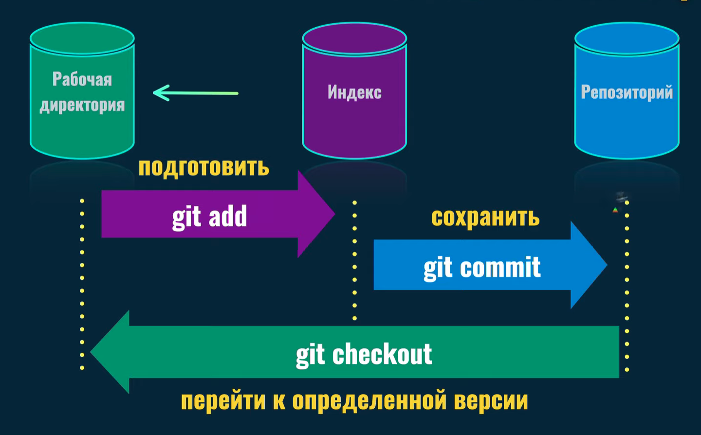
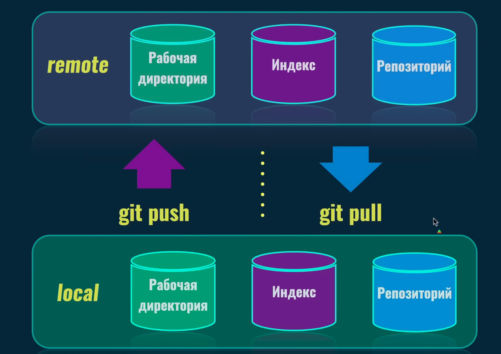

# КОМАНДЫ GIT
---

## Основные команды терминала
* Команда выводит путь к текущей папке  
```
pwd   
```  
* Создание папки
```
mkdir название папки
```

* Перейти в папку 
```
cd название папки
```
* Перейти в родительскую папку
```
cd ..
```

* Создание пустого файла
```
touch название файла
```

*  Создание файла с текстом
```
echo "Any text" > file.txt
```
* Список файлов в папке
```
ls
```
* Прочитать файл
```
cat file.txt
```
* Удаление файла
```
rm file.txt
```  
* [Команды удаления файлов и папок через терминал](https://baks.dev/article/terminal/how-to-remove-files-and-directories-using-linux-command-line)

* Открытие проекта через терминал в редакторе кода
 1. Открыть окно с настройками (Mac: Cmd + Shift + P, Win: Ctrl + Shift + P)
 2. Выбрать Shell Command: Install 'code' command in PATH
 
 3. После этого набрать в терминале команду
 ```
 code .
 ```
 4. Проект откроется в редакторе кода

### Проверка версии GIT

```
git --version
```
-

### Настройка имени и email автора
* **gitconfig** - Изменение конфигурации Git
* **--global** - Имя будет настроено глобально для всех репозиториев
* **user.name** - Настройка имени автора
* **user.email** - Настройка емэйла автора

*Имя автора будет использоваться во всех репозиториях на вашем компьютере и будет браться из этого файла конфигурации*

```
git config --global user.name "Your Name"
git config --global user.email "your email"
```
### Просмотр всех настроек Git
```
git config --list
```
-
### Создание нового репозитория на компьютере в текущей папке
*Команда вводится в той папке, в которой планируется создать новый пустой репозиторий*

```
git init
```
После инициализации репозитория создается скрытая папка **.git**

### Удаление локального репозитория

Если был создан случайно репозиторий локально, можно просто удалить папку .git, это полностью уничтожит репозиторий  и, разумеется, отменит то,что сделал ``` git init``` команда:  
```
rm -r .git
```

### Связывание локального репозитория с удаленным

```
git remote add origin URL репозитория
```

* Отображение скрытых папрк и файлов  
Terminal, iTerm2 (Mac), Git Bash (Windows)  
```
ls -la
```
* PowerShell (Windows)  
```
ls -Force
```

### Области Git


* Рабочая директория (**Working directory**) - видимые файлы и папки проекта.
* Индекс (**Staging area**) - в эту область добавляются файлы, которые хотим сохранить. Подготавливаем файлы для коммита.
* Репозиторий (**Repository**) - сохранение файлов в репозиторий. То,что находится в папке .git. Там хранится информация обо всех версиях проекта, коммитов 

Зона **Staging area** и **Repository** скрыты в папке .git

-
### Проверка текущего состояния репозитория

Эта команда показывает те изменения,которые уже находятся в **Staging area** и которые были подготовлены для коммита.

```
git status
```

*ВСЕ ОБЪЕКТЫ GIT СОХРАНЯЮТСЯ В ПАПКУ objects, в которой создаются подпапки с хэш-номером(уникальный идентификатор) объекта.*

### Добавление файлов в Staging area
Команда *git add* добавляет файл, либо файлы из **Working directory**  в **Staging area**

```
git add название файла
```  

Этой командой мы подготавливаем файлы для сохранения в репозиторий, посредством перемещения в **Staging area**

### Сохранение изменений (commit)

Команда *git commit* сохраняет файлы из **Staging area** в **Repository**

```
git commit
```

Создается объект git со своим идентификационным номером, который помещается в папку .git/objects

### Переход к определенной версии проекта

Git берет объекты из репозитория и переносит их в рабочую директорию.

```
git checkout
```


### Статусы отслеживания файлов
* **Untracked** - Неотслеживаемый, те файлы, которые только что добавили в **Working directory** (Новый файл)

*  **Staged** - Подготовленный, файл, добавленный в **Staging area**

* **Unmodified** - Немодифицированный, те файлы, которые сохранены в **Repository**

* **Modified** - Модифицированный, файлы находящиеся в рабочей директории и которые можно подготовить для сохранения(перенести в **Staging area**) после этого их состояние становится **Staged**

### КОММИТ (Commit)

Коммит - это ссылка на определенное дерево. Все коммиты связаны между собой. Также это объект git, который созраняется в папке .git.

Указатель(Ссылка) **HEAD** на определенный коммит, т.е. в **Working directory** мы видим именно ту версию проекта, на которую ссылается **HEAD** указатель

Ветка ссылки всегда ссылается на последний коммит, чтобы видеть самую свежую версию.

# ОСНОВНЫЕ КОМАНДЫ
-
### ШПОРА
[Шпаргалка](https://frontend-stuff.com/blog/git-cheat-sheet/)

**git-status** показывает какие файлы были изменены или добавлены, а также показывает какие файлы находятся в **Staging area**

```
git status
```

Команда **git add** подготавливает файлы перед коммитом, занося их в **Staging area**  

```
git add
```

Команда **git add -A** возьмет абсолютно все файлы, которые находятся в папке,в которой был создан репозиторий и добавит их в в **Staging area**
  
```
git add -A
```

Команда **git add .** добавит файлы только текущей директории, в которой запущена команда и добавит их в в **Staging area**

```
git add .
```

[Подробнее здесь](https://ru.stackoverflow.com/questions/431839/%D0%92-%D1%87%D0%B5%D0%BC-%D1%80%D0%B0%D0%B7%D0%BD%D0%B8%D1%86%D0%B0-%D0%BC%D0%B5%D0%B6%D0%B4%D1%83-git-add-add-a-add-u-%D0%B8-add)

Сохранение всех изменений из **Staging area** в **Repository** с названием коммита  
*Сообщение указывает на то,что сделано в этом коммите*

```
git commit -m "message"
```
Команда **git log** показывает историю изменений коммитов  

```
git log
```

Команда **git checkout** с помощью нее и хэш номера коммита можно перейти в определенную версию проекта
Можно использовать 4 или 5 начальных символов коммита. После этого Git переместит указатель HEAD на определенный коммит, который мы указали. Т.е git возьмет объекты,соответствующие этому коммиту и переместит их в рабочую область.

```
git checkout commit hash
```

Также с помощью этой команды можно перейти на определенную ветку проекта. Ветка ссылается на последний коммит,сделанный в этой ветке

```
git checkout branch name
```

Git созраняет содержимое объектов в бинарном формате, поэтому чтобы прочитать объект Git есть специальные команды: 
 
**git cat-file -t хэш номер**
флаг -t указывает на тип объекта

```
git cat-file -t хэш номер(достаточно первых 7 символов)
```  
Команда

```
git cat-file -p хэш номер(достаточно первых 7 символов)
```
покажет содержимое коммита

-

### ВЕТКИ Git

**ВЕТКА** - это ссылка на коммит. Когда мы работаем в рамках одной ветки, Git автоматически перемещает ссылку на самый последний коммит. Указатель **HEAD** используется для переключения между ветками и перехода на разные коммиты этих веток.

Команда создания новой ветки. Название лучше давать такое, по которому можно понять,что именно разрабатывается в этой ветке.

```
git branch branch name
```

Переключение между ветками. Указатель HEAD перемещается на указанную ветку 

```
git checkout branch name
```

Создание новой ветки и переход в нее

```
git checkout -b branch name
```

Отображает список ветвей в проекте

```
git branch
```

Переименовать **ТЕКУЩУЮ** ветку

```
git branch -m new branch name
```

Удаление ветки. Текущую ветку нельзя удалить, если вы хотите удалить текущую ветку, нужно из нее выйти

```
git branch -d branch name
```
-

### СЛИЯНИЯ ВЕТОК

Слияние ветки (feature branch) в текущую ветку (receiving branch). Т.е указываем название ветки, которую хотим слить с текущей веткой. Для этого нужно перейти в ту ветку и находясь в ней произвести команду:

```
git merge feature branch name
```

После этого git автоматически создаст merge commit, у которого будет 2 родительских коммита

#### Процесс слияния веток

1. Создать новую ветку **new-feature** из ветки **main**
2. Перейти в новую ветку **new-feature**
3. Внести изменения в проект (создание новых файлов и папок, изменить существующие)
4. Создать коммит или несколько коммитов в ветке **new-feature**
5. Перейти обратно в ветку **main** и также создать коммиты
6. Выполнить слияние ветки **new-feature** в ветку **main**
7. После слияния ветку **new-feature** можно удалить (т.к все коммиты этой ветки сохранятся в merge commit ветки main)

После слияния веток выведется сообщение "Merge made by the 'ort' strategy"  
ort strategy - это стратегия объединения веток по умолчанию для всех версий гита начиная с 2.31.0

---

### Сервисы хостинга GIT репозиториев

#### Самые распространенные сервисы

1. [GitHub](https://github.com/)
2. [BitBucket](https://bitbucket.org/)
3. [GitLab](https://about.gitlab.com/)

#### Связь локального и удаленного репозитория



Команда для копирования удаленного репозитория в локальный (клонирование репозитория)

```
git clone url
```

Т.е все объекты git скачиваются с удаленного репозитория и устанаваливаются на ваш компьютер  

Если репозиторий публичный (Public), то абсолютно любой человек может скачать себе на компьютер этот репозиторий,если же частный (Private), то сделать это могут только те, у кого есть права

**ORIGIN** - это имя удаленного репозиторися по-умолчанию.

Команда **git branch -a** отображает все ветки, включая те, которые находятся в удаленных репозиториях

```
git branch -a
```

Абсолютно любая ветка доступна нам после того, как мы установили связь с удаленным репозиторием и мы можем на нее переключаться с помощью команды  ``git checkout branch name``

Команда **git pull** - загрузка и применение изменений с удаленной ветки в локальную

```
git pull
```

Т.е если локально мы находимся в ветке new-Feature, то примени команду мы скачаем изменения с этой же ветки удаленног репозитория, но для этог необходимо, чтобы была связь между локальным и удаленным репозиторием

Команда **git push** - загрузка изменений из локальной ветки в ветку удаленного репозитория

#### Подключение удаленного репозитория

```
git remote add origin url
```

**origin** - это название репозитория,которое можно использовать в дальнейшем и не вводить url репозитория

Также можно связывать локальный репозиторий с несколькими удаленными репозиториями, как правило такой репозиторий только один.

Команда **git push -u origin branch** - загрузка изменений из локальной ветки в удаленную с созданием связи между ними

```
git push -u origin branch name(название удаленной ветки)
```

В этой команде говорим Git, что при первой загрузке изменений из локальной ветки main на удаленный сервер под названием origin, мы хотим связать локальную ветку main с соответствующей удаленной веткой, например тоже main

Дальнейшие загрузки изменений в ветку удаленного репозитория после установки связи между локальной и удаленной ветками

```
git push
```

Проверка как именно локальная ветка master связана с удаленной веткой master

```
git branch -vv
```

Проверка на создание удаленных серверов на локальном  

```
git remote
```

## To Be Continued.............


